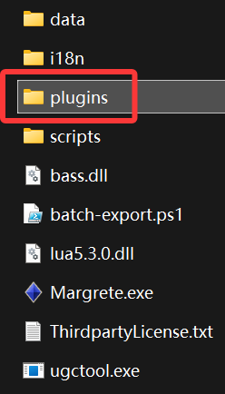
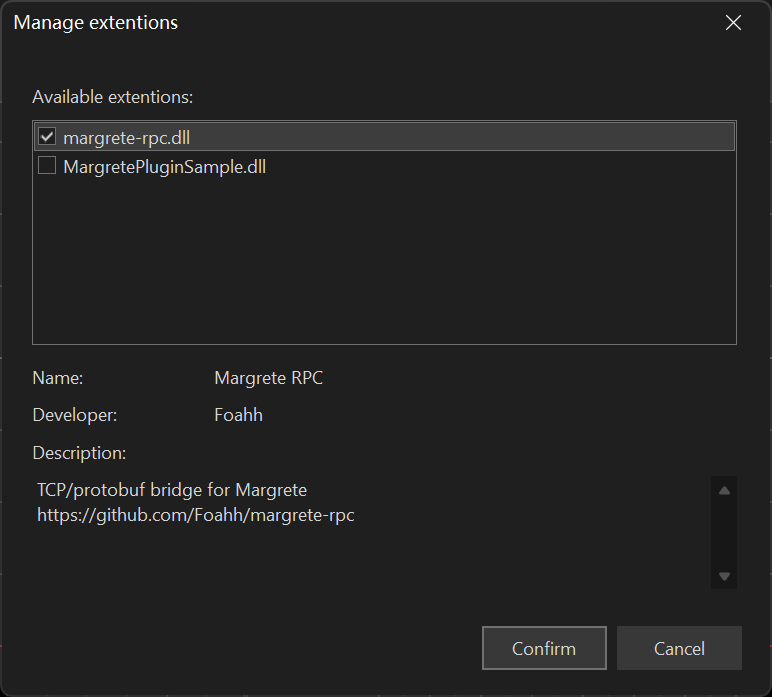

import { PencilIcon, MusicIcon, ClockIcon, TriangleAlertIcon } from "lucide-react";

**Margrete RPC** is a plugin + SDK system that lets you script chart editing for [UMIGURI/Margrete](https://umgr.inonote.jp/en/margrete/intro) from Python.

The Python SDK lets you read and rewrite charts programmatically — place notes, edit events, and apply changes as named, undoable edits inside the editor.

## Requirements

- Python 3.13 or later
- Margrete 1.8.0 or later

## Installation

### 1. Install the plugin

Download the latest release from the [GitHub Releases page](https://github.com/Foahh/margrete-rpc/releases) and place both `margrete-rpc.dll` and `margrete-rpc.ini` in your Margrete plugins directory (`%MARGRETE_DIR%\plugins\`).



Restart Margrete after copying. Then open **Extensions** → **Manage Extensions** and enable **Margrete RPC**.



### 2. Install the Python SDK

```bash
pip install margrete-rpc
```

Or with [uv](https://github.com/astral-sh/uv):

```bash
uv add margrete-rpc
```

## Quick start

Connect to the running Margrete instance and open an edit transaction:

```python
from margrete_rpc import Margrete
from margrete_rpc.chart.notes import Tap

m = Margrete()  # auto-detect the running plugin instance

with m.open_edit("add a tap") as tx:
    tx.chart.notes.append(Tap(t=(0, 0, 0), x=0, w=4))
# changes are applied when the with block exits cleanly
```

`t=(0, 0, 0)` is a `(bar, beat, offset)` position tuple — bar 0, beat 0, offset 0. Inside a `with m.open_edit()` block these tuples resolve to absolute ticks automatically using the chart's time signature.

## Connecting to a specific instance

`Margrete()` with no arguments discovers the single running plugin instance. When multiple instances are running, or when you want a deterministic connection, pass `endpoint` or `instance_id`:

```python
from margrete_rpc import Margrete, list_instances

# list all discovered instances
for inst in list_instances():
    print(inst.instance_id, inst.endpoint)

# connect by explicit host:port
m = Margrete(endpoint="localhost:12345")

# connect by the instance_id shown in the plugin
m = Margrete(instance_id="abc123")
```

## Checking server status

```python
status = m.status()
print(f"Plugin v{status.server_version} (pid {status.pid})")
print(f"Log: {status.log_path}")
```

## Error handling

```python
from margrete_rpc import Margrete, MargreteError, MargreteDiscoveryError

try:
    m = Margrete()
except MargreteDiscoveryError as exc:
    print("Could not find a running Margrete instance:", exc)

try:
    with m.open_edit("my edit") as tx:
        ...
except MargreteError as exc:
    print("RPC error:", exc)
```

If the `with` block raises any exception the edit is **not** applied. Margrete only sees the change when the block exits cleanly.

## Learn more

<Cards>
  <Card
    icon={<PencilIcon />}
    title="Edit Transactions"
    href="/docs/guides/transactions"
    description="Atomic chart edits with open_edit."
  />
  <Card
    icon={<MusicIcon />}
    title="Note Types"
    href="/docs/guides/notes"
    description="Tap, Hold, Slide, AirCrush, and more."
  />
  <Card
    icon={<ClockIcon />}
    title="Time & Position"
    href="/docs/guides/time"
    description="Ticks, bar/beat positions, and beat fractions."
  />
  <Card
    icon={<TriangleAlertIcon />}
    title="Limitations"
    href="/docs/limitations"
    description="Known constraints and workarounds."
  />
</Cards>
