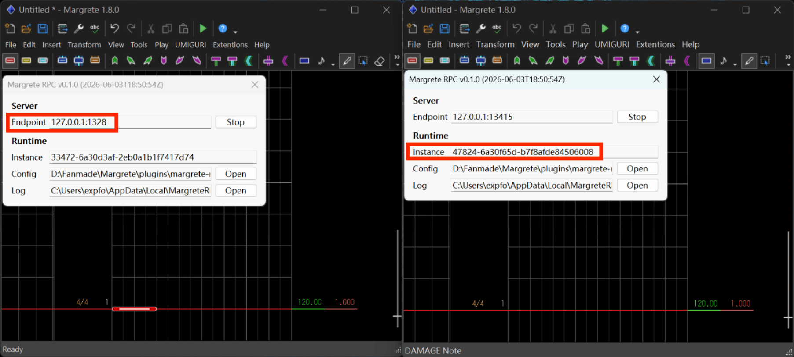

`Margrete()` 会通过名为 `margrete-XXXX` 的命名管道自动检测正在运行的插件实例。通常情况下，如果只打开了一个 Margrete 窗口，直接使用 `Margrete()` 即可。如果同时运行了多个实例，请传入插件对话框中显示的四位编号：

```python
from margrete_rpc import Margrete, list_instances

# 列出所有正在运行的实例
for inst in list_instances():
    print(inst.instance_id, inst.pipe_name)

# 通过四位编号连接（左侧的 Margrete）
with Margrete("0421") as m_left:
    print(m_left.status())

# 完整名称也可以（右侧的 Margrete）
with Margrete("margrete-0999") as m_right:
    print(m_right.status())
```


